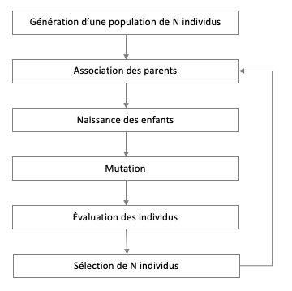
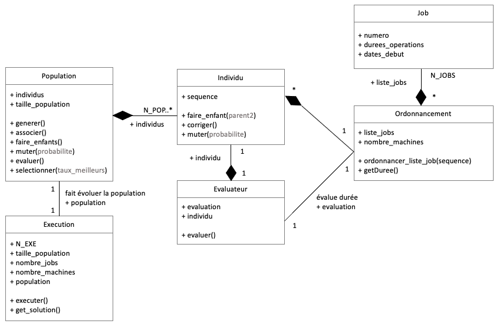
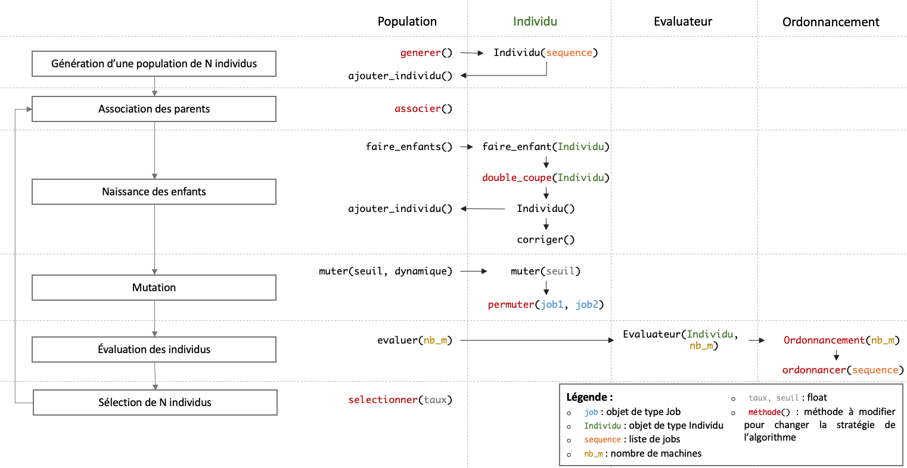

# Algorithme Génétique

**Auteurs :** Amaury COLIN, Daniel BALLESTEROS

**Date :** 21 décembre 2022

**Version :** v0.1

**Langage de programmation :** Python

**Cadre de l'exercice :** cours de résolution approchée, UE E de *Conception, Optimisation, et Pilotage des Systèmes Industriels (COPSI)* à [IMT Atlantique](https://imt-atlantique.fr).

## Exécution de l'algorithme

Pour exécuter l'algorithme, il faut s'assurer d'avoir numpy d'installé dans son environnement Python.

Pour lancer l'exécution, après le paramétrage effectué, il faut exécuter le fichier

		genetique.py

## Paramétrage de l'algorithme génétique

L'algorithme offre plusieurs possibilités de paramétrage qui sont regroupées dans le fichier *config.py*.

Ainsi, il est possible de paramétrer :

* Le jeu de données (*FICHIERS_DONNES*)
* La taille de la population (*N*)
* Le nombre d'évolutions de la population (*NOMBRE_ITERATIONS*)
* Le nombre d'exécution, *i.e.* le nombre de fois où l'on lance l'algorithme génétique pour conserver la meilleure solution (*NOMBRE_EXECUTIONS*)
* La fonction de probabilité d'une mutation (*PROBABILITE\_MUTATION_FONCTION*)
* Le seuil de probabilité d'avoir une mutation (*PROBABILITE\_MUTATION\_SEUIL_DEPART*)
* L'activation de la mutation dynamique (*PROBABILITE\_MUTATION_DYNAMIQUE*)
* Le seuil de probabilité d'avoir une mutation lorsqu'on atteint un optimum local et que la mutation dynamique est activée (*MUTATION\_DYNAMIQUE_SEUIL*)
* Le taux de meilleurs individus conservés à chaque sélection de population (*SEUIL\_SELECTION_MEILLEURS*)
* L'affichage :
	* Afficher le nom de l'algorithme au démarrage (*AFFICHER\_NOM_ALGORITHME*)
	* Afficher la population à chaque itération (*AFFICHER_POPULATION*)
	* Afficher le nombre d'individus en double dans la population (*AFFICHER\_NOMBRE_DOUBLONS*)
	* Afficher les nouveaux individus (enfants) (*AFFICHER_NOUVEAUX\_INDIVIDUS*)
	* Afficher la population avec les parents et les enfants (*AFFICHER\_POPULATION\_APRES_NAISSANCE*)
	* Afficher les corrections faites sur les enfants (*AFFICHER_CORRECTIONS*)
	* Afficher les mutations faites sur les enfants (*AFFICHER_MUTATIONS*)
	* Afficher les évaluations des individus de la population (*AFFICHER_EVALUATIONS*)
	* Afficher les individus sélectionnés (*AFFICHER_SELECTIONNES*)
	* Afficher le meilleur individu à chaque itération (*AFFICHER\_MEILLEUR\_A\_CHAQUE_ITERATION*)
	* Afficher le graphique de la progression de chaque recherche (*AFFICHER_GRAPHIQUE*)
	* Afficher le temps d'exécution pour trouver un optimum local (*AFFICHER\_TEMPS_EXECUTION*)

	
	

## Fonctionnement de l'algorithme génétique

## Structure de l'algorithme génétique

L'algorithme a été structuré à l'aide de plusieurs classes telles que :

où N\_POP représente la taille de la population et N\_EXE le nombre d'évolution de la population.

La méthode *associer* de la classe *Population* permet de créer des couples de parents. L'adoption d'une stratégie d'association peut être une voie d'amélioration de l'algorithme.

La méthode *faire_enfants* de la classe *Population* permet de créer des enfants à partir d'un couple de parents. Elle utilise la méthode *faire_enfant* de la classe *Individu*. Par défaut, nous avons implémenté une permutation de sous-séquences des ADN des parents, cette méthode est appelée *double_coupe* dans le code de la classe *Individu*. D'autres méthodes de création d'enfants peuvent être essayées.

La méthode *muter* de la classe *Population* permet de faire muter les nouveaux enfants de la population par rapport à une probabilité donnée. Elle utilise la méthode *muter* de la classe *Individu*. En cas d'optimum local trouvé, nous augmentons la probabilité d'avoir des mutations chez les enfants. Pour cela, il suffit de passer *PROBABILITE\_MUTATION\_DYNAMIQUE* à *True* dans *config.py*.

L'évaluation se fait avec la méthode *evaluer* de *Population*. Pour chaque individu, elle a recours à une instance de la classe *Evaluateur*. La méthode d'évaluation peut être changée dans cette dernière. Par défaut, nous utilisons la valeur minimale pour un ordonnancement dans le cas d'un flowshop de permutation avec *nombre_machines*.

La sélection de la population se fait avec la méthode *selectionner* de *Population*. La sélection se fait sur la base des évaluations des individus. On définit un taux de meilleurs individus et on tire le reste au hasard.

